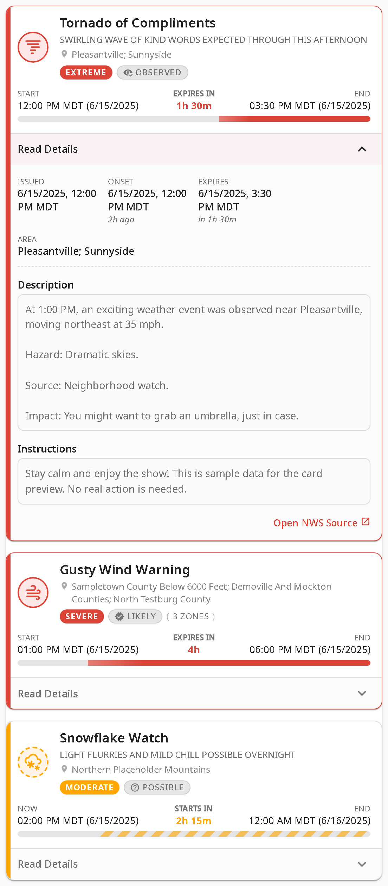
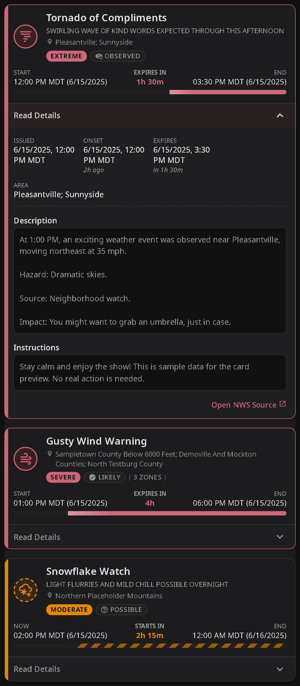
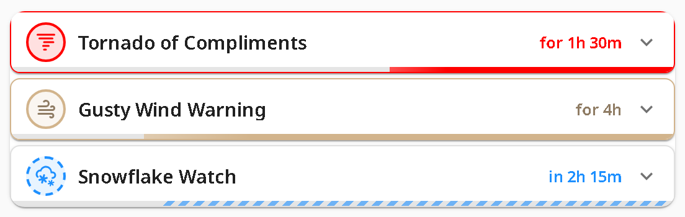
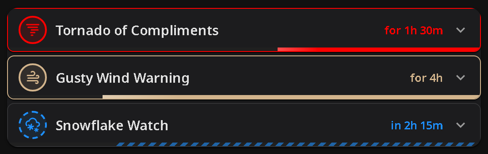

# NWS Alerts Card

A custom Home Assistant Lovelace card for displaying weather alerts with severity indicators, progress bars, and expandable details. Supports NWS (National Weather Service, US) and BoM (Bureau of Meteorology, Australia).

**Default layout** — severity colors, expanded details

| Light | Dark |
|:---:|:---:|
|  |  |

**Compact layout** — NWS official colors

| Light | Dark |
|:---:|:---:|
|  |  |

## Features

- Multi-provider support — works with NWS (US) and BoM (Australia) alert sensors, with auto-detection
- Severity-based color coding with animated borders for extreme/severe alerts
- Optional NWS official hazard-map colors keyed by event type
- Progress bars showing elapsed/remaining time for each alert with relative ("in 2h 30m") and absolute timestamps in the HA user's configured timezone
- Expandable details with description, instructions, and source link — HTML content is sanitized before rendering
- Phase lifecycle badges for BoM warnings (New, Updated, Renewed, etc.)
- Compact layout — collapsed single-row view that expands on tap
- Zone-based alert filtering
- Configurable sort order (default, onset time, or severity)
- Visual configuration editor (no YAML required)
- Card picker integration (add from HA UI)
- Shadow DOM — no style conflicts, full HA theme support

## Prerequisites

One of the following alert integrations:

- **NWS (US)**: [NWS Alerts integration](https://github.com/finity69x2/nws_alerts) v6.1+
- **BoM (Australia)**: [Bureau of Meteorology integration](https://github.com/bremor/bureau_of_meteorology) or [HA BoM Australia](https://github.com/safepay/ha_bom_australia)

## Installation

### HACS (recommended)

1. Open HACS in Home Assistant
2. Search for "NWS Alerts Card" and install
3. Refresh your browser

### Manual

1. Download `nws-alerts-card.js` from the [latest release](../../releases/latest)
2. Copy to `config/www/nws-alerts-card.js`
3. Add the resource in **Settings → Dashboards → Resources** (requires Advanced Mode enabled in your user profile):
   - URL: `/local/nws-alerts-card.js`
   - Type: JavaScript Module

## Configuration

| Option       | Type     | Required | Default      | Description                        |
|--------------|----------|----------|--------------|------------------------------------|
| `entity`     | string   | yes      | —            | Entity ID (e.g. `sensor.nws_alerts_alerts` or `sensor.sydney_warnings`) |
| `provider`   | string   | no       | auto-detect  | Alert provider: `'nws'`, `'bom'`, or omit to auto-detect from entity attributes |
| `title`      | string   | no       | —            | Card header title                  |
| `zones`      | string[] | no       | —            | Filter alerts to specific zone codes (NWS zone/county codes or BoM `area_id` values; omit to show all) |
| `sortOrder`  | string   | no       | `'default'`  | Sort alerts: `'default'` (integration order), `'onset'` (soonest first), `'severity'` (most severe first) |
| `colorTheme` | string   | no       | `'severity'` | Color scheme: `'severity'` (HA theme colors by severity bracket) or `'nws'` (NWS official hazard-map colors by event type) |
| `animations` | boolean  | no       | —            | `true`: always animate; `false`: never animate; omit to respect the OS `prefers-reduced-motion` accessibility setting |
| `layout`     | string   | no       | `'default'`  | Card layout: `'default'` (full detail) or `'compact'` (collapsed single-row alerts that expand on tap) |

### Basic

```yaml
type: custom:nws-alerts-card
entity: sensor.nws_alerts_alerts
```

### With title and zone filtering

```yaml
type: custom:nws-alerts-card
entity: sensor.nws_alerts_alerts
title: Weather Alerts
zones:
  - COC059
  - COZ039
  - COZ239
```

### NWS official colors, compact layout, sorted by severity

```yaml
type: custom:nws-alerts-card
entity: sensor.nws_alerts_alerts
colorTheme: nws
layout: compact
sortOrder: severity
```

### Australian BoM warnings

```yaml
type: custom:nws-alerts-card
entity: sensor.sydney_warnings
```

The provider is auto-detected from entity attributes. To set it explicitly:

```yaml
type: custom:nws-alerts-card
entity: sensor.sydney_warnings
provider: bom
```

## Integration Setup

### NWS Alerts (United States)

This card works with the [NWS Alerts](https://github.com/finity69x2/nws_alerts) custom integration to provide the `sensor.nws_alerts_alerts` entity.

1. Install via HACS: **Integrations** → **Explore & Download Repositories** → search "NWS Alerts"
2. Restart Home Assistant
3. **Settings → Devices & Services → Add Integration** → search "NWS Alerts"
4. Enter your zone/county codes (find yours at [alerts.weather.gov](https://alerts.weather.gov/))

> **Note**: Zone codes must be comma-delimited with **no spaces** (e.g. `COC059,COZ039,COZ239`). Adding spaces after commas causes the integration to silently return no alerts.

### Bureau of Meteorology (Australia)

This card works with either BoM integration:

- [Bureau of Meteorology](https://github.com/bremor/bureau_of_meteorology) — the original integration
- [HA BoM Australia](https://github.com/safepay/ha_bom_australia) — an upgraded fork with additional binary sensors per warning type

Both expose the same `sensor.{location}_warnings` entity with identical warning data. Enable the warnings sensor during integration setup. Zone filtering is supported using BoM `area_id` values (e.g. `NSW_FL049`).

## Development

```bash
npm install
npm run build     # bundle → dist/nws-alerts-card.js
npm run watch     # bundle with file watching
npm run lint      # TypeScript type-check
```

### Local HA dev container

```bash
npm run build
docker compose -f .docker/docker-compose.yml up
```

Access Home Assistant at http://localhost:8123. The card JS is volume-mounted read-only — rebuild on the host and refresh the browser to see changes.

After the HA onboarding flow, add the card resource via **Settings → Dashboards → Resources** (URL: `/local/nws-alerts-card.js`, type: JavaScript Module). Then add the card to any dashboard — it will appear in the card picker as "NWS Alerts Card".

### Resources

- [Home Assistant Community thread](https://community.home-assistant.io/t/nws-alerts-card)
